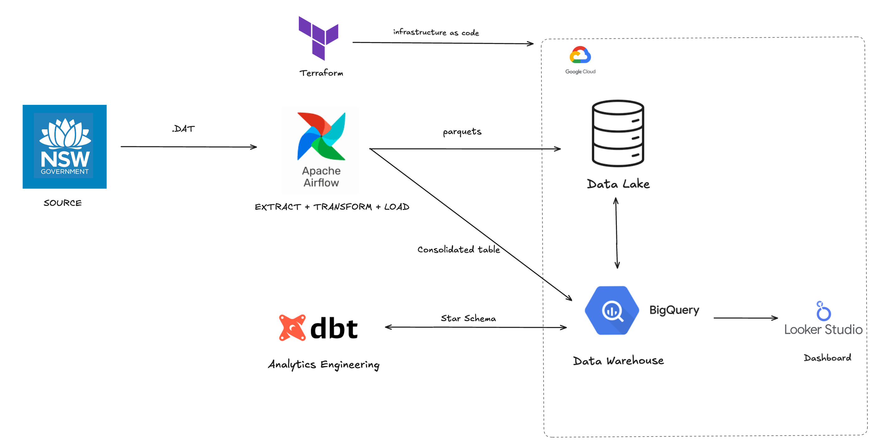

#  NSW Property Data Pipeline

## Overview

This project builds a complete end-to-end data pipeline to model and analyze NSW property sales data from 2001 to 2025. 

This project uses Terraform, Airflow and dbt to manage infrastructure, data ingestion and transform into analytics ready BigQuery warehouse 

The final data is present as a [dashboard](https://lookerstudio.google.com/reporting/c735ef86-4beb-4cbe-bbf0-20ea2c529941) in Looker Studio which gives suburb level insights into price-trends, growth rates and property sales summary. 

**Project Goals**

Automate property data ingestion from NSW government sources
Build a scalable, maintainable data transformation pipeline
Enable analytics and insights on property market trends
Implement data quality checks and monitoring

**Key Features**

Automated Data Pipeline: Orchestrated with Apache Airflow
Modern Data Stack: dbt for transformations, BigQuery for warehousing
Data Quality: Comprehensive testing with 59 data tests
Incremental Processing: Efficient handling of new data
Audit Trail: Complete lineage and audit logging


## Architecture




**Technology Stack**

* Cloud Platform: Google Cloud Platform (GCP)
* Data Warehouse: BigQuery (australia-southeast1)
* Orchestration: Apache Airflow
* Transformation: dbt (Data Build Tool)
* Language: Python 3.13
* Version Control: Git

**Data Flow**

```
NSW Data Source → GCS/BigQuery → dbt (Staging) → dbt (Core) → dbt (Marts) → Analytics/BI Tools
                                        ↓
                                   Audit Logs
```


## Project Structure

```
nsw_property_DE_project/        # Terraform setup to GCP
├── 1_terraform/
    ├── main.tf
│   ├── variables.tf                
├── 2_airflow/                  # Airflow DAGs and configuration
│   ├── dags/
│   ├── local_2024/
|   ├── Dockerfile
|   ├── requirements.txt
|   ├── README.md
├── 3_dbt/                      # dbt project
│   └── nsw_property_project/
│       ├── models/
│       │   ├── staging/        # Raw data cleaning (Views)
│       │   ├── core/           # Business logic (Tables)
│       │   ├── marts/          # Analytics models (Tables)
│       │   └── audit/          # Manual QA checks in Big Query(Views)
│       ├── tests/              # Custom data tests
│       ├── macros/             # Reusable SQL macros
│       ├── seeds/              # Reference data (1 seed)
│       └── dbt_project.yml
├── images/
└── README.md
```

---

## Data Pipeline

### Pipeline Overview
The pipeline follows an **ELT pattern** with initial transformation in Airflow before loading to the warehouse:
- **Extract & Transform**: Airflow downloads, parses, and transforms raw data
- **Load**: Airflow loads processed data to GCS and BigQuery
- **Transform (dbt)**: Additional business logic and dimensional modeling in BigQuery


### Pipeline Stages

#### 1. **Extract (Airflow)**

**DAG**: `Annual_data`  
**Task Group**: Download and extraction tasks  
**Schedule**: Manual trigger (on-demand)

**Data Source**: 
- NSW Valuer General yearly ZIP archives
- URL: `https://www.valuergeneral.nsw.gov.au/__psi/yearly/{year}.zip`
- Format: Nested ZIP files containing .DAT files (VALNET format)
- Coverage: 2001-2025 (25 years)

**Process**:
1. **Download yearly ZIP** - Fetch archive from NSW Valuer General website
2. **Recursive extraction** - Unzip nested archives to locate all .DAT files
3. **Collect .DAT files** - Consolidate files from nested directory structure

**Output**: Local .DAT files ready for transformation


#### 2. **Transform (Airflow)**

**Task Group**: Data processing and transformation  
**Technology**: Python (pandas, pyarrow)

**Transformations**:
- **Parse VALNET format** - Convert proprietary .DAT format to structured data
- **Data filtering**:
  - Property types: RESIDENCE and VACANT LAND only
  - Valid postcodes only (numeric, 4 digits)
  - Date range validation (1989-2262)
- **Data cleaning**:
  - Type casting (integers, dates, strings)
  - Null handling and coercion
  - Timestamp precision to milliseconds
- **Generate unique IDs** - MD5 hash of key fields for deduplication
- **Format conversion** - Convert to Parquet with compression

**Data Quality Rules**:
- Remove invalid/out-of-range dates
- Filter non-residential properties
- Validate numeric fields (price, land area)
- Ensure required fields are present

**Output**: Cleaned Parquet files with schema validation


#### 3. **Load (Airflow)**

**Task Group**: Upload and BigQuery operations  
**Technology**: GCS, BigQuery

**3a. Load to GCS**
- Upload Parquet files to Cloud Storage
- Path: `gs://{bucket}/raw/yearly/all_sales_{year}.parquet`
- One file per year (24 files total)

**3b. Load to BigQuery**
- **Create dataset** - `nsw_prop_data_all` (if not exists)
- **Create final table** - Target table with full schema
- **Create external tables** - Point to GCS Parquet files (one per year)
- **Create temp tables** - Add unique_row_id for deduplication
- **MERGE operation** - Upsert into final consolidated table

#### 4. **Staging Layer (dbt)**

**Purpose**: Clean, deduplicate, and standardize raw BigQuery data  
**Materialization**: Views (for data freshness)  
**Source**: `nsw_prop_data_all.final_table`

**Key Model**: `stg_google_nswprop_data_2001_2024`

**Transformations**:
- **Two-stage deduplication**:
  - Stage 1: Dedupe by `unique_row_id` (keep latest `processed_datetime`)
  - Stage 2: Dedupe by transaction fields (property_id + contract_date + settlement_date + address)
- **Safe type casting**: Integers, dates, timestamps using dbt macros
- **Field standardization**:
  - Trim and uppercase text fields (street_name, suburb, locality)
  - Convert blanks to NULL (`nullif(trim(...), '')`)
  - Rename fields for clarity (section_no → unit_number, locality → suburb)
- **Property classification**:
  - Custom macro `classify_property_type()` - Derives property type from unit/street numbers
  - Custom macro `classify_property_flag()` - Flags unusual property configurations
- **Data quality**: Filters out records with missing critical address fields

**Output**: Clean, deduplicated property sales transactions ready for dimensional modeling


#### 5. **Core Layer (dbt)**

**Purpose**: Dimensional modeling with star schema (Kimball methodology)  
**Materialization**: Tables (for query performance)  
**Pattern**: Fact table + dimension tables with surrogate keys

**Dimension Tables**:

**`dim_dates`** (Table)
- Date dimension with calendar hierarchies
- Generated using `dbt_utils.date_spine` (1990-2030)
- Includes: year, quarter, month, week, day attributes
- Primary key: `date_id` (integer YYYYMMDD format, e.g., 20250101)
- Year-week composite key for time-series analysis

**`dim_location`** (Table)
- Geographic dimension with location hierarchies
- Joins postcodes to GCCSA (Greater Capital City Statistical Areas)
- Deduplication: One record per suburb-postcode combination
- Includes: suburb, postcode, LGA code, GCCSA code/name
- Primary key: `location_id` (surrogate key from postcode + suburb + LGA)
- Filters: Greater Sydney and Rest of NSW only

**`dim_location_cleaned`** (Table)
- Cleaned version with row_number deduplication
- Ensures one canonical record per suburb-postcode
- Removes NULL GCCSA records

**`dim_property_type`** (Table)
- Property type reference dimension
- Canonicalizes property types (e.g., "TOWN HOUSE" variants → "TOWN HOUSE")
- Includes: property_type, property_category (Residential/Vacant/Other), flags
- Boolean flags: `is_residential`, `is_vacant_land`
- Primary key: `property_type_sk` (MD5 hash of type + category + flag)

**`dim_property`** (Table, Incremental, SCD Type 1)
- Property master dimension with full address details
- Incremental updates: New/changed properties only
- Unique key: `property_sk` (MD5 hash of property_id + full address)
- Deduplication: Latest `processed_datetime` per property
- Includes: address components, land area, zoning, building details
- Tracks `last_seen` timestamp for audit purposes

**`dim_property_cleaned`** (Table)
- Cleaned version with additional deduplication
- One canonical record per unique address combination
- Uses row_number over property attributes

**Fact Table**:

**`fact_property_sales`** (Table, Incremental)
- Grain: One row per property sale transaction
- Unique key: `unique_row_id` (from staging)
- Foreign keys to all dimensions:
  - `property_sk` → dim_property
  - `contract_date_id` → dim_dates
  - `settlement_date_id` → dim_dates
  - `location_id` → dim_location
  - `property_type_sk` → dim_property_type
- Measure: `sale_price`
- Incremental strategy: Append new transactions only
- Join logic: Multi-field matching for property FK lookup

**Star Schema Design**:
```
┌─────────────┐
│  dim_dates  │
│ (date_id)   │
└──────┬──────┘
       │
       │ contract_date_id
       │ settlement_date_id
       │
       ┴────────────────────────────────┐
                                        │
      ┌─────────────────────┐           │     ┌──────────────────┐
      │   dim_location      │           │     │ dim_property_type│
      │  (location_id)      │           │     │(property_type_sk)│
      └─────────┬───────────┘           │     └────────┬─────────┘
                │                       │              │
         location_id                    |       property_type_sk
                │                       │              │
         ┌──────┴───────────────────────┴──────────────┴───────┐
         │         fact_property_sales                          │
         │         (unique_row_id)                              │
         │                                                      │
         │  • property_sk                                       │
         │  • contract_date_id, settlement_date_id              │
         │  • location_id                                       │
         │  • property_type_sk                                  │
         │  • sale_price (measure)                              │
         └──────────────────────┬───────────────────────────────┘
                                │
                                │ property_sk
                                │
                     ┌──────────┴──────────┐
                     │   dim_property      │
                     │   (property_sk)     │
                     └─────────────────────┘
 
```

**Key Features**:
- Surrogate keys (MD5 hashes) for all dimensions
- SCD Type 1 for property dimension (overwrite latest state)
- Incremental fact table loading for performance
- Defensive joins with `coalesce()` for NULL handling
- Audit timestamps (`created_at`, `last_seen`)

---

## Data Models

### Key Models

#### Staging Layer

| Model | Description | Materialization |
|-------|-------------|----------------|
| `stg_google_nswprop_data_2001_2024` | Cleaned and deduplicated property sales data from Airflow's `final_table` | View |

### Core Layer

| Model | Description | Materialization |
|-------|-------------|----------------|
| `dim_dates` | Date dimension with calendar hierarchies (1990-2030) | Table |
| `dim_location` | Location dimension with suburb, postcode, LGA, GCCSA mappings | Table |
| `dim_location_cleaned` | Deduplicated location dimension (one record per suburb-postcode) | Table |
| `dim_property` | Property master dimension with address and land details (SCD Type 1) | Table (Incremental) |
| `dim_property_cleaned` | Deduplicated property dimension (canonical addresses) | Table |
| `dim_property_type` | Property type reference dimension with residential/vacant flags | Table |
| `fact_property_sales` | Sales fact table with price measures and dimension foreign keys | Table (Incremental) |

### Marts Layer

| Model | Description | Materialization |
|-------|-------------|----------------|
| `fct_suburb_price_periods` | Suburb-level price trends with 1yr/3yr/5yr growth rates and CAGR calculations | Table (analytics schema) |
| `fct_sales_volume` | Sales volume metrics by time period, location, and property type with price aggregations | Table (analytics schema) |
| `fct_property_price_trends` | Yearly property price trends segmented by region and property type | Table (analytics schema) |

**Mart Details:**

#### `fct_suburb_price_periods`
- **Purpose**: Historical price analysis for suburbs with multiple time windows
- **Schema**: `analytics.fct_suburb_price_periods`
- **Key Features**:
  - Outlier removal using IQR (Interquartile Range) method before calculating medians
  - Current year median prices compared to 1/3/5 years ago
  - Growth percentages and CAGR (Compound Annual Growth Rate) calculations
  - Data quality thresholds: minimum 5 sales for 1yr, 25 for 3yr, 40 for 5yr windows
  - Reliability flags (`has_reliable_1y_growth`, `has_reliable_3y_growth`, etc.)
  - Overall reliability indicator (`is_reliable_suburb` when lifetime_sales ≥ 50)
- **Filters**: Greater Sydney and Rest of NSW only, prices $100k-$20M, post-2000 data
- **Grain**: One row per suburb + property type + region combination
- **Use Cases**: Suburb investment analysis, price appreciation trends, market comparison

#### `fct_sales_volume`
- **Purpose**: Transaction volume analysis across time periods and geography
- **Schema**: `analytics.fct_sales_volume`
- **Key Features**:
  - Time hierarchies: year, quarter, month with formatted strings (e.g., "2024-Q1", "2024-03")
  - Geographic breakdowns: region, LGA, suburb, postcode
  - Property type and category segmentation
  - Volume metric: `total_sales` (distinct transaction count)
  - Price context: median, average, min, max, total value
- **Filters**: Prices $100k-$20M, post-2000 data
- **Grain**: One row per time period + location + property type combination
- **Use Cases**: Market activity monitoring, sales velocity analysis, geographic hotspot identification

#### `fct_property_price_trends`
- **Purpose**: Long-term yearly price trends by property type and region
- **Schema**: `analytics.fct_property_price_trends`
- **Key Features**:
  - Yearly median sale prices from 2001 onwards
  - Regional comparison: Greater Sydney vs Rest of NSW
  - Property type segmentation (House, Unit/Apartment, Town House, Vacant Land)
  - Uses contract_date for trend analysis
- **Filters**: Greater Sydney and Rest of NSW only, 2001 onwards
- **Grain**: One row per year + region + property type
- **Use Cases**: Long-term market trend analysis, property type performance comparison, regional growth patterns

**Common Design Patterns:**
- All marts use `analytics` schema with descriptive aliases
- Consistent price filtering: $100k-$20M (removes data errors and extreme outliers)
- Time filtering: Post-2000 data only (ensures data quality)
- Region focus: Greater Sydney and Rest of NSW
- Approximate quantiles (`approx_quantiles()`) for performance on large datasets
- Join pattern: `fact_sales` → dimension tables for enrichment

---

## Setup and Installation

**Prerequisites**
1. Python 3.13+
2. Google Cloud Platform account
3. BigQuery enabled
4. Service account with BigQuery permissions
5. dbt installed

For Installation, refer to the guide under each subfolder to replicate it in your local repo. 